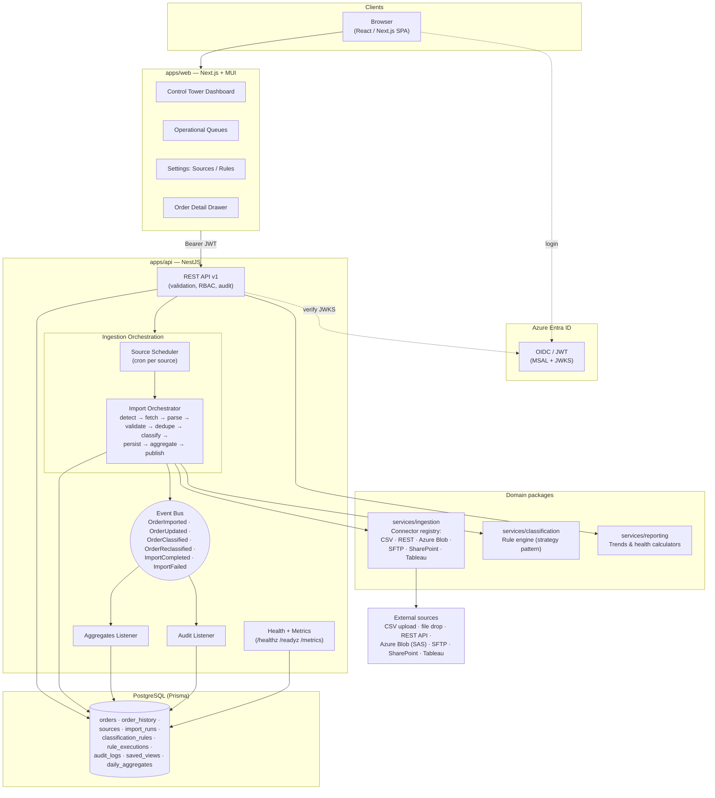

# Order Control Tower — Architecture

## Overview

The Order Control Tower replaces an Excel-based dashboard with a modern SaaS-style
operational platform. It ingests order data from configurable sources, classifies
orders through a database-driven rule engine, and surfaces operational state through
dashboards, queues and drill-downs — with full auditability.

The system is a **modular monolith deployed as two containers** (API + Web) backed by
PostgreSQL. Domain logic lives in versioned workspace packages
(`services/ingestion`, `services/classification`, `services/reporting`) that are
consumed by the NestJS API. This keeps deployment simple (Azure App Service /
Container Apps friendly) while preserving clean service boundaries — any of the three
services can be split into its own process later without rewriting domain code.
Internal communication is event-driven via an in-process event bus
(`@nestjs/event-emitter`); event names and payloads are typed and centralised so the
bus can be swapped for Azure Service Bus / Kafka.

## Architecture diagram

## Request / ingestion flow

1. **Detect** — the Source Scheduler registers a cron job per enabled source
   (from `sources.schedule`). Manual uploads and "Run now" hit the same orchestrator.
2. **Fetch** — the connector for the source type retrieves file(s)
   (`services/ingestion` connector registry — strategy pattern, new connectors
   register without touching the orchestrator).
3. **Parse & map** — CSV parsed with a per-source column mapping (configured in the UI).
4. **Validate** — required fields, types; row-level failures recorded on the import run log.
5. **Deduplicate** — natural key `(orderNumber, productCode)`; existing orders are
   updated and a full snapshot is written to `order_history`.
6. **Classify** — the rule engine evaluates enabled rules in priority order;
   the full evaluation trace persists to `rule_executions`.
7. **Persist** — orders, run stats, logs in one transactional flow.
8. **Aggregate** — `daily_aggregates` upserted from classification events.
9. **Publish** — typed events emitted; audit listener writes `audit_logs`.

## Security

- **AuthN**: Microsoft Entra ID OIDC. SPA uses MSAL (auth-code + PKCE); API validates
  bearer JWTs against tenant JWKS. `AUTH_ENABLED=false` gives a local dev identity.
- **AuthZ**: RBAC via Entra app roles (`admin`, `operator`, `viewer`) enforced with a
  `@Roles()` guard. Admin: settings/rules/sources. Operator: bulk actions, uploads.
  Viewer: read-only.
- **OWASP**: helmet headers, strict CORS allow-list, global validation pipe
  (whitelist + forbid unknown), Prisma parameterised queries, file-upload
  size/type limits, no secrets in code (env only), audit of every mutation.

## Observability

- Structured JSON logging (nestjs-pino style logger, request-scoped context).
- OpenTelemetry: `OTEL_ENABLED=true` boots the Node SDK with auto-instrumentations
  and OTLP export (Azure Monitor compatible).
- `/healthz` (liveness), `/readyz` (DB round-trip), `/metrics` (Prometheus:
  process metrics + import/classification counters).
- Error tracking hook: a single `ErrorTrackingService` seam where Sentry /
  App Insights SDKs can be attached.

## Deployment

- Two images (`apps/api/Dockerfile`, `apps/web/Dockerfile`), multi-stage, non-root.
- `infrastructure/docker-compose/docker-compose.yml` for local / single-VM.
- `infrastructure/deployment/` — Azure Container Apps Bicep + App Service notes.
- Migrations run with `prisma migrate deploy` on API start-up (idempotent).
