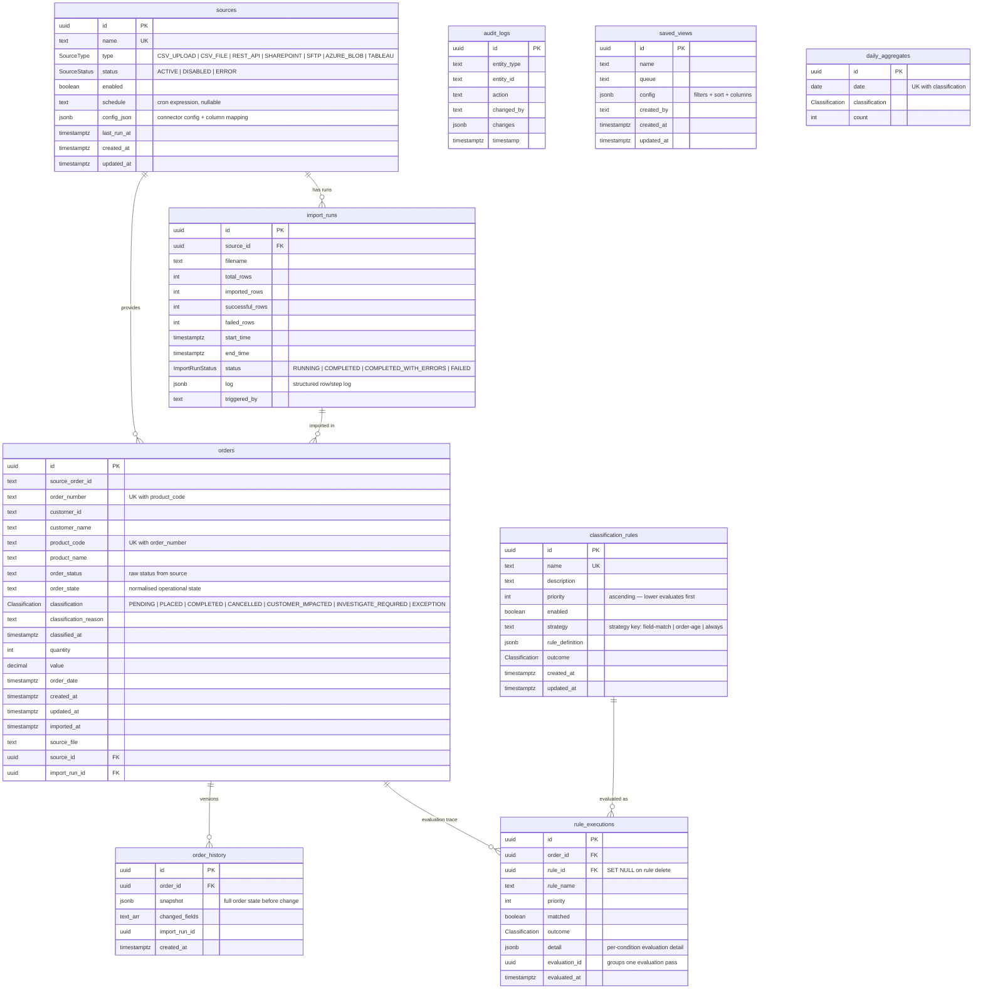

# Order Control Tower — Database ERD

PostgreSQL, managed by Prisma (`apps/api/prisma/schema.prisma`).
Raw SQL migration: `infrastructure/migrations/0001_init.sql`.

## Key constraints

| Constraint | Purpose |
|---|---|
| `orders (order_number, product_code)` unique | Deduplication natural key — re-imports update in place |
| `order_history.order_id` FK cascade | History travels with the order |
| `rule_executions.rule_id` FK `SET NULL` | Trace survives rule deletion (name retained) |
| `daily_aggregates (date, classification)` unique | Idempotent aggregate upserts |
| Indexes on `orders.classification`, `orders.order_date`, `orders.customer_name`, `audit_logs (entity_type, entity_id)` | Queue filtering, trends, audit drill-down |
